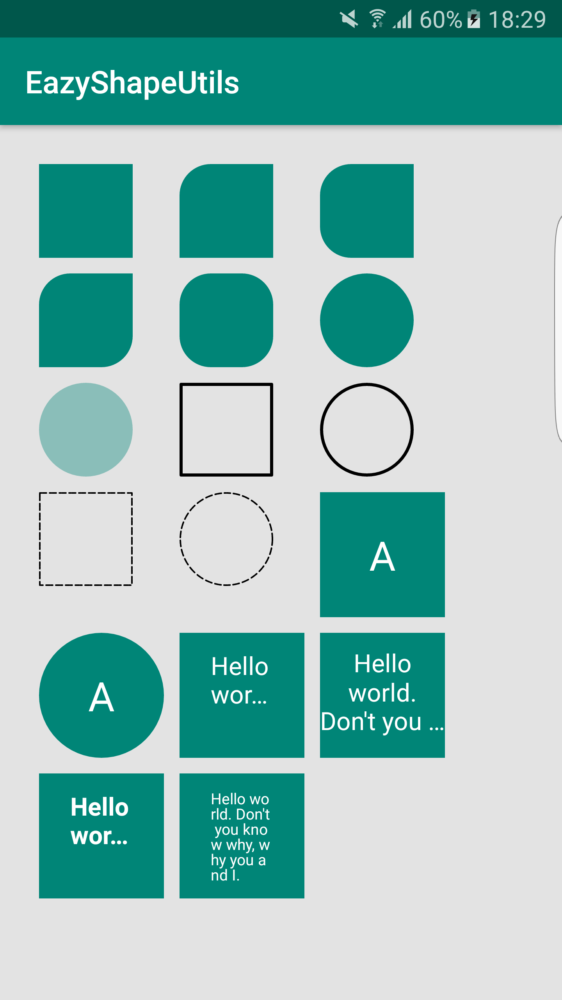

# ShapeView

ShapeView是一个轻量级并且简单易用的专为Android设计的View库。使用ShapeView你将可以在使用到矩形、圆角矩形、圆形的简单图形时避免创建频繁且不必要的Shape文件。


## Usage examples



从上到下，从左到右的依次实现方式如下：

**例1：**
```
 <eazy.eazyshapeutils.shape.CommonShapeView
                android:layout_width="60dp"
                android:layout_height="60dp"
                android:layout_margin="5dp"
                app:shapeColor="@color/colorPrimary"
                app:layout_constraintTop_toTopOf="parent"
                app:layout_constraintLeft_toLeftOf="parent"
                app:layout_constraintBottom_toBottomOf="parent"/>
```
> app:shapeColor ---指定View颜色
> 在XML布局中添加以上属性，将指定一个边长为60dp的正方形


**例2：**
```
<eazy.eazyshapeutils.shape.CommonShapeView
                android:layout_width="60dp"
                android:layout_height="60dp"
                android:layout_margin="5dp"
                app:shapeColor="@color/colorPrimary"
                app:shapeRadiusPosition="top_left"
                app:shapeRoundRectSize="20dp"
                app:layout_constraintTop_toTopOf="parent"
                app:layout_constraintLeft_toLeftOf="parent"
                app:layout_constraintBottom_toBottomOf="parent"/>
```
> app:shapeColor ---指定View颜色
> 
> app:shapeRadiusPosition  ---指定View圆角位置（包含上左、上右、下左、下右、左、上、右、下）
  
> app:shapeRoundRectSize  ---指定View圆角大小

**例3：**
```
<eazy.eazyshapeutils.shape.CommonShapeView
                android:layout_width="60dp"
                android:layout_height="60dp"
                android:layout_margin="5dp"
                app:shapeColor="@color/colorPrimary"
                app:shapeRadiusPosition="left"
                app:shapeRoundRectSize="20dp"
                app:layout_constraintTop_toTopOf="parent"
                app:layout_constraintLeft_toLeftOf="parent"
                app:layout_constraintBottom_toBottomOf="parent"/>
```
> app:shapeColor ---指定View颜色
> 
> app:shapeRadiusPosition  ---指定View圆角位置（包含上左、上右、下左、下右、左、上、右、下）
> 
> app:shapeRoundRectSize  ---指定View圆角大小


**例4：**
```
 <eazy.eazyshapeutils.shape.CommonShapeView
                android:layout_width="60dp"
                android:layout_height="60dp"
                android:layout_margin="5dp"
                app:shapeColor="@color/colorPrimary"
                app:shapeRadiusPosition="top_left_and_bottom_right"
                app:shapeRoundRectSize="20dp"
                app:layout_constraintTop_toTopOf="parent"
                app:layout_constraintLeft_toLeftOf="parent"
                app:layout_constraintBottom_toBottomOf="parent">
```
> app:shapeColor ---指定View颜色
> 
> app:shapeRadiusPosition  ---指定View圆角位置（包含上左、上右、下左、下右、左、上、右、下以及全部）
> 
> app:shapeRoundRectSize  ---指定View圆角大小

**例5：**
```
 <eazy.eazyshapeutils.shape.CommonShapeView
                android:layout_width="60dp"
                android:layout_height="60dp"
                android:layout_margin="5dp"
                app:shapeColor="@color/colorPrimary"
                app:shapeRadiusPosition="all"
                app:shapeRoundRectSize="20dp"
                app:layout_constraintTop_toTopOf="parent"
                app:layout_constraintLeft_toLeftOf="parent"
                app:layout_constraintBottom_toBottomOf="parent"/>
```
> app:shapeColor ---指定View颜色
> 
> app:shapeRadiusPosition  ---指定View圆角位置（包含上左、上右、下左、下右、左、上、右、下以及全部）
> 
> app:shapeRoundRectSize  ---指定View圆角大小

**例6：**
```
 <eazy.eazyshapeutils.shape.CommonShapeView
                android:layout_width="60dp"
                android:layout_height="60dp"
                android:layout_margin="5dp"
                app:shapeColor="@color/colorPrimary"
                app:shapeRadiusPosition="all"
                app:shapeRoundRectSize="30dp"
                app:layout_constraintTop_toTopOf="parent"
                app:layout_constraintLeft_toLeftOf="parent"
                app:layout_constraintBottom_toBottomOf="parent"/>
```
> app:shapeColor ---指定View颜色
> 
> app:shapeRadiusPosition  ---指定View圆角位置（包含上左、上右、下左、下右、左、上、右、下以及全部）
> 
> app:shapeRoundRectSize  ---指定View圆角大小

**例7：**
```
 <eazy.eazyshapeutils.shape.CommonShapeView
                android:layout_width="60dp"
                android:layout_height="60dp"
                android:layout_margin="5dp"
                app:shapeColor="@color/colorPrimary"
                app:shapeRadiusPosition="all"
                app:shapeRoundRectSize="30dp"
                app:shapeAlpha="100"
                app:layout_constraintTop_toTopOf="parent"
                app:layout_constraintLeft_toLeftOf="parent"
                app:layout_constraintBottom_toBottomOf="parent"/>
```
> app:shapeColor ---指定View颜色
> 
> app:shapeRadiusPosition  ---指定View圆角位置（包含上左、上右、下左、下右、左、上、右、下以及全部）
> 
> app:shapeRoundRectSize  ---指定View圆角大小
> 
> app:shapeAlpha  ---指定View透明度（范围0~255）
> 

**例8：**
```
<eazy.eazyshapeutils.shape.CommonShapeView
                android:layout_width="60dp"
                android:layout_height="60dp"
                android:layout_margin="5dp"
                app:isStrokeOrFill="true"
                app:shapeStrokeWidth="2dp"
                app:shapeColor="@color/colorBlack"
                app:layout_constraintTop_toTopOf="parent"
                app:layout_constraintLeft_toLeftOf="parent"
                app:layout_constraintBottom_toBottomOf="parent"/>
```
> app:shapeColor ---指定View颜色
> 
> app:isStrokeOrFill  ---指定View是实心还是空心，true为空心，false为实心，默认为false
> 
> app:shapeStrokeWidth ---指定View线条大小

**例9：**
```
<eazy.eazyshapeutils.shape.CommonShapeView
                android:layout_width="60dp"
                android:layout_height="60dp"
                android:layout_margin="5dp"
                app:isStrokeOrFill="true"
                app:shapeStrokeWidth="2dp"
                app:shapeColor="@color/colorBlack"
                app:shapeRadiusPosition="all"
                app:shapeRoundRectSize="30dp"
                app:layout_constraintTop_toTopOf="parent"
                app:layout_constraintLeft_toLeftOf="parent"
                app:layout_constraintBottom_toBottomOf="parent"/>
```
> app:shapeColor ---指定View颜色
> 
> app:isStrokeOrFill  ---指定View是实心还是空心，true为空心，false为实心，默认为false
> 
> app:shapeStrokeWidth ---指定View线条大小
> 
> app:shapeRadiusPosition ---指定View圆角位置
> 
> app:shapeRoundRectSize ---指定View圆角大小

**例10：**
```
<eazy.eazyshapeutils.shape.CommonShapeView
                android:layout_width="60dp"
                android:layout_height="60dp"
                android:layout_margin="5dp"
                app:isStrokeOrFill="true"
                app:shapeStrokeWidth="1dp"
                app:isSolidOrDotted="false"
                app:shapeColor="@color/colorBlack"
                app:layout_constraintTop_toTopOf="parent"
                app:layout_constraintLeft_toLeftOf="parent"
                app:layout_constraintBottom_toBottomOf="parent"/>
```
> app:shapeColor ---指定View颜色
> 
> app:isStrokeOrFill  ---指定View是实心还是空心，true为空心，false为实心，默认为false
> 
> app:shapeStrokeWidth ---指定View线条大小
> 
> app:isSolidOrDotted ---指定View线条是实线还是虚线，true为实线，false为虚线，，默认为true


**例11：**
```
<eazy.eazyshapeutils.shape.CommonShapeView
                android:layout_width="60dp"
                android:layout_height="60dp"
                android:layout_margin="5dp"
                app:isStrokeOrFill="true"
                app:shapeStrokeWidth="1dp"
                app:isSolidOrDotted="false"
                app:shapeColor="@color/colorBlack"
                app:shapeRadiusPosition="all"
                app:shapeRoundRectSize="30dp"
                app:layout_constraintTop_toTopOf="parent"
                app:layout_constraintLeft_toLeftOf="parent"
                app:layout_constraintBottom_toBottomOf="parent"/>
```
> app:shapeColor ---指定View颜色
> 
> app:isStrokeOrFill  ---指定View是实心还是空心，true为空心，false为实心，默认为false
> 
> app:shapeStrokeWidth ---指定View线条大小
> 
> app:isSolidOrDotted ---指定View线条是实线还是虚线，true为实线，false为虚线，，默认为true
> 
> app:shapeRadiusPosition ---指定View圆角位置
> 
> app:shapeRoundRectSize ---指定View圆角大小


**例12：**
```
<eazy.eazyshapeutils.shape.CommonShapeView
                android:layout_width="80dp"
                android:layout_height="80dp"
                android:layout_margin="5dp"
                app:textString="A"
                app:textColor="@color/colorWhite"
                app:textSize="26sp"
                app:shapeColor="@color/colorPrimary"
                app:layout_constraintTop_toTopOf="parent"
                app:layout_constraintLeft_toLeftOf="parent"
                app:layout_constraintBottom_toBottomOf="parent">
```
> app:shapeColor ---指定View颜色
> app:textString  ---指定View中文字的内容
> app:textColor ---指定View中文字的颜色
> app:textSize ---指定View中文字的大小
> 若未设置PaddingLeft、PaddingTop、PaddingBottom、PaddingRight，则文字将居中展示，并且文字长度过长将显示省略号...

**例13：**
```
<eazy.eazyshapeutils.shape.CommonShapeView
                android:layout_width="80dp"
                android:layout_height="80dp"
                android:layout_margin="5dp"
                app:shapeRadiusPosition="all"
                app:shapeRoundRectSize="40dp"
                app:textString="A"
                app:textColor="@color/colorWhite"
                app:textSize="26sp"
                app:shapeColor="@color/colorPrimary"
                app:layout_constraintTop_toTopOf="parent"
                app:layout_constraintLeft_toLeftOf="parent"
                app:layout_constraintBottom_toBottomOf="parent"/>
```
> app:shapeColor ---指定View颜色
> 
> app:textString  ---指定View中文字的内容
> 
> app:textColor ---指定View中文字的颜色
> 
> app:textSize ---指定View中文字的大小
> 
> app:shapeRadiusPosition ---指定View圆角位置
> 
> app:shapeRoundRectSize ---指定View圆角大小
> 
> 若未设置PaddingLeft、PaddingTop、PaddingBottom、PaddingRight，则文字将居中展示，并且文字长度过长将显示省略号...


**例14：**
```
<eazy.eazyshapeutils.shape.CommonShapeView
                android:layout_width="80dp"
                android:layout_height="80dp"
                android:layout_margin="5dp"
                android:paddingTop="10dp"
                android:paddingBottom="10dp"
                android:paddingLeft="20dp"
                android:paddingRight="20dp"
                app:textString="Hello world. Don't you know why, why you and I."
                app:textColor="@color/colorWhite"
                app:textSize="16sp"
                app:shapeColor="@color/colorPrimary"
                app:layout_constraintTop_toTopOf="parent"
                app:layout_constraintLeft_toLeftOf="parent"
                app:layout_constraintBottom_toBottomOf="parent"/>
```
> app:shapeColor ---指定View颜色
> 
> app:textString  ---指定View中文字的内容
> 
> app:textColor ---指定View中文字的颜色
> 
> app:textSize ---指定View中文字的大小
> 
> app:shapeRadiusPosition ---指定View圆角位置
> 
> app:shapeRoundRectSize ---指定View圆角大小
> 
> 若设置了PaddingTop、PaddingBottom、PaddingLeft、PaddingRight则从paddingLeft处开始显示文字，若文字太长将换行，若仍然太长将显示省略号...


**例15：**
```
<eazy.eazyshapeutils.shape.CommonShapeView
                android:layout_width="80dp"
                android:layout_height="80dp"
                android:layout_margin="5dp"
                app:textString="Hello world. Don't you know why, why you and I."
                app:textColor="@color/colorWhite"
                app:textSize="16sp"
                app:shapeColor="@color/colorPrimary"
                app:layout_constraintTop_toTopOf="parent"
                app:layout_constraintLeft_toLeftOf="parent"
                app:layout_constraintBottom_toBottomOf="parent"/>
```
> app:shapeColor ---指定View颜色
> 
> app:textString  ---指定View中文字的内容
> 
> app:textColor ---指定View中文字的颜色
> 
> app:textSize ---指定View中文字的大小
> 
> app:shapeRadiusPosition ---指定View圆角位置
> 
> app:shapeRoundRectSize ---指定View圆角大小
> 
> 若未设置PaddingLeft、PaddingTop、PaddingBottom、PaddingRight，则文字将居中展示，并且文字长度过长将显示省略号...

**例16：**
```
<eazy.eazyshapeutils.shape.CommonShapeView
                android:layout_width="80dp"
                android:layout_height="80dp"
                android:layout_margin="5dp"
                android:paddingTop="10dp"
                android:paddingBottom="10dp"
                android:paddingLeft="20dp"
                android:paddingRight="20dp"
                app:textString="Hello world. Don't you know why, why you and I."
                app:textType="bold"
                app:textColor="@color/colorWhite"
                app:textSize="16sp"
                app:shapeColor="@color/colorPrimary"
                app:layout_constraintTop_toTopOf="parent"
                app:layout_constraintLeft_toLeftOf="parent"
                app:layout_constraintBottom_toBottomOf="parent">
```
> app:shapeColor ---指定View颜色
> 
> app:textString  ---指定View中文字的内容
> 
> app:textColor ---指定View中文字的颜色
> 
> app:textSize ---指定View中文字的大小
> 
> app:textType  ---指定View中文字的样式，目前仅支持加粗和斜体
> 
> app:shapeRadiusPosition ---指定View圆角位置
> 
> app:shapeRoundRectSize ---指定View圆角大小
> 
> 若未设置PaddingLeft、PaddingTop、PaddingBottom、PaddingRight，则文字将居中展示，并且文字长度过长将显示省略号...

**例17：**
```
<eazy.eazyshapeutils.shape.CommonShapeView
                android:layout_width="80dp"
                android:layout_height="80dp"
                android:layout_margin="5dp"
                android:paddingTop="10dp"
                android:paddingBottom="10dp"
                android:paddingLeft="20dp"
                android:paddingRight="20dp"
                app:textString="Hello world. Don't you know why, why you and I."
                app:textColor="@color/colorWhite"
                app:shapeColor="@color/colorPrimary"
                app:multi_line_complete="true"
                app:layout_constraintTop_toTopOf="parent"
                app:layout_constraintLeft_toLeftOf="parent"
                app:layout_constraintBottom_toBottomOf="parent"/>
```
> app:shapeColor ---指定View颜色
> 
> app:textString  ---指定View中文字的内容
> 
> app:textColor ---指定View中文字的颜色
> 
> app:textSize ---指定View中文字的大小
> 
> app:textType  ---指定View中文字的样式，目前仅支持加粗和斜体
> 
> app:shapeRadiusPosition ---指定View圆角位置
> 
> app:shapeRoundRectSize ---指定View圆角大小
> 
> app:multi_line_complete="true"  ---该属性指定View中文字的大小根据Padding及
View的宽高进行自适应，如果你需要文字全部展示在Padding范围内，那么加上该属性。


